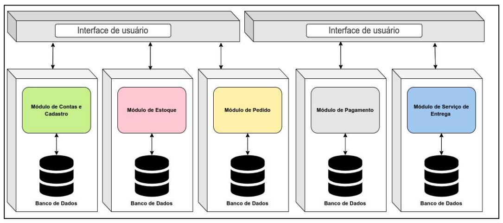

# Arquitetura Distribuída

Neste artigo, prosseguiremos com as discussões sobre a arquitetura de software, e especificamente abordaremos o estilo arquitetônico distribuído. Além disso, exploraremos tanto os aspectos positivos quanto os negativos deste estilo.

### 1. Arquitetura Distribuída

Ao contrário da arquitetura monolítica, uma arquitetura distribuída consiste em vários serviços executados em seu próprio ecossistema e comunicando entre si por meio de protocolos de rede (RICHARDS; FORD, 2020). Tais serviços, em muitas das vezes, possuem réplicas que também executam em múltiplas máquinas. Devido a essas características, os sistemas distribuídos possuem maior disponibilidade, são mais confiáveis (por haver redundância) e escaláveis (BURNS, 2018).

Ao contrário da arquitetura monolítica, uma arquitetura distribuída consiste em vários serviços executados em seu próprio ecossistema e comunicando entre si por meio de protocolos de rede (RICHARDS; FORD, 2020). Tais serviços, em muitas das vezes, possuem réplicas que também executam em múltiplas máquinas. Devido a essas características, os sistemas distribuídos possuem maior disponibilidade, são mais confiáveis (por haver redundância) e escaláveis (BURNS, 2018).

Arquiteturas distribuídas podem apresentar formas mais dinâmicas de implementação, pois como vários componentes formam a arquitetura, cada um pode ter sua própria estratégia de design, desenvolvimento e implantação, permitindo execução de trabalhos em paralelo, maior independência entre equipes, favorecendo a agilidade de entrega de funcionalidades (RICHARDS; FORD, 2020).

A Figura 3 representa uma arquitetura distribuída onde a interface gráfica interage e estabelece relações com diversos serviços, cada um com seu próprio banco de dados e exercendo uma função específica.

<figure><figcaption>
Figura 3 – Representação Arquitetura Distribuída. Fonte: (RICHARDS; FORD, 2020), adaptado pelo Autor.
</figcaption></figure>

Alguns exemplos de arquiteturas que seguem o estilo distribuído são (RICHARDS; FORD, 2020):&#x20;

* Arquitetura orientada a eventos;
* Arquitetura orientada a serviços;&#x20;
* Arquitetura de microsserviços.

Apesar de suas características robustas em termos de escalabilidade, confiabilidade e disponibilidade, arquiteturas distribuída possuem design mais complexo devendo considerar diversas questões como orquestração dos serviços, transacionabilidade das operações, assincronicidade, além de considerar trade-offs como sacrifício de consistência (RICHARDS; FORD, 2020).

De acordo com Richards e Ford (2020) existem diversos pontos de atenção ou falácias que estão presentes em qualquer arquitetura que segue o estilo distribuído e precisam ser conhecidos.

### 2. Falácias de Arquiteturas Distribuídas

**2.1. Falácia nº 1: A rede é confiável**&#x20;

A rede pode falhar por diversas razões: o DNS de um endpoint pode não ser resolvido devido a uma má configuração. Portanto, é necessário realizar o desenvolvimento de sistemas distribuídos considerando formas de mitigar o impacto das falhas de rede, caso contrário, o sistema sofrerá com os 33 impactos dessas falhas e sua qualidade pode ser afetada catastroficamente.

**2.2. Falácia nº 2: A latência é zero**&#x20;

A latência pode ser definida como o tempo necessário para que dados se movam de um local para outro através da rede. O processamento que antes era feito localmente em um processador, agora pode ser dividido em vários componentes da arquitetura distribuída. Uma chamada para um outro serviço através da rede leva um tempo muito maior que uma chamada local de um método em uma serviço. Construir um sistema ignorando a latência pode ter um grande impacto na experiência do usuário e no desempenho geral do sistema, uma vez que, em uma arquitetura distribuída, a integração entre serviços acontece, frequentemente, através da rede.&#x20;

**2.3. Falácia nº 3: A largura de banda é infinita**&#x20;

A largura de banda pode ser definida como a capacidade de enviar uma determinada quantidade de dados durante um intervalo de tempo fixo através da rede (PETERSON; DAVIE, 2012). Em um sistema distribuído com dezenas, ou até mesmo centenas de máquinas se comunicando umas com as outras e trocando grandes quantidades de informações, a largura de banda pode se tornar um gargalo, gerando perda de pacotes, entrega de mensagens fora de ordem, comprometendo o desempenho do sistema e gerando, inclusive, instabilidade do mesmo.

**2.4. Falácia nº 4: A rede é segura**&#x20;

A segurança em sistemas distribuídos é mais complexa do que em sistemas monolíticos, pelo fato de mais recursos como, por exemplo, endpoints e banco de dados necessitarem, cada um, de mecanismos de seguranças próprios. Essa situação aumenta a complexidade de construção do sistema. Portanto, é essencial planejamento e a adoção de uma postura onde a segurança é priorizada e avaliada constantemente desde o começo do design do sistema.

**2.5. Falácia nº 5: A topologia nunca muda**

Desenvolver um sistema idealizando que seu ambiente de execução permanecerá com condições específicas (por exemplo, configurar os IPs de outros serviços de maneira hardcoded no código) durante toda a vida útil é o que a quinta falácia discute. Com o advento da nuvem e tecnologias como containers, a topologia de rede se tornou mais dinâmica. O dimensionamento elástico (capacidade de adicionar ou remover servidores dependendo da carga de trabalho) é um exemplo dessa dinamicidade.

**2.6. Falácia nº 6: Há apenas um administrador**

Um sistema construído utilizando arquitetura distribuída é composto por inúmeros serviços, muitos desses serviços são desenvolvidos por equipes diferentes. Devido ao grande número de participantes na construção do sistema, é pouco provável que exista uma única pessoa que terá conhecimento e entendimento completo sobre todo o sistema. Portanto, é essencial implantar governanças que facilitem a manutenção e difusão do conhecimento para auxiliar no troubleshooting e resolução de problemas.&#x20;

**2.7. Falácia nº 7: O custo de transporte é zero**&#x20;

Para se transportar dados de uma máquina para outra há diversos custos envolvidos no processo. Um deles é o custo da infraestrutura como, por exemplo, hardware, firewalls e proxies. Outro exemplo de custo está relacionado à comunicação, pois, para estabelecê-la, a requisição deve trafegar na rede e para isso é serializada e depois deserializada. Esse processo exige processamento e acarreta no intenso uso de hardwares como CPU, além disso há o custo vinculado à internet. Dessa forma, é indispensável para a concepção de um projeto de um sistema distribuído considerar esses fatores ao projetar os custos do sistema.

**2.8. Falácia nº 8: A rede é homogênea**&#x20;

Uma rede homogênea pode ser definida como sendo uma rede de computadores iguais utilizando as mesmas configurações e se comunicando através do mesmo protocolo. É esperado em sistemas distribuídos a necessidade de se integrarem com componentes heterogêneos. Portanto, é necessário desenvolver arquiteturas distribuídas pensando em interoperabilidade

### 3. Desafios Relacionados à Arquitetura Distribuída

Além das oito falácias, existem outros desafios associados à arquitetura distribuída que se mostram como grandes obstáculos. Estes são pontos devem ser avalidados cuidadosamente antes de optar pela implementação da arquitetura distribuída. Dentre eles, podemos citar:

**3.1. Logs distribuídos**&#x20;

Devido a natureza descentralizada do sistema distribuído, a rastreabilidade da execução dos workflows através do registro de evento (registro de logs) se torna mais complexo, pois, diferentemente de um sistema monolítico onde se têm apenas um registro de log para todo o sistema, um sistema distribuído é composto por inúmeros registros, cada um vinculado a uma instância em execução de cada componente do sistema (RICHARDS; FORD, 2020).&#x20;

A rastreabilidade é indispensável para qualquer sistema de software, pois possibilita a realização de análises sobre a execução dos workflows, identificação das causas de falhas e comportamentos inesperados. Para viabilizar a rastreabilidade é essencial a utilização de ferramentas de agregação de registro de logs como Splunk além de técnicas de rastreabilidade de transações como TraceIDs (identificadores únicos que são compartilhados entre os componente para identificar a execução de uma transação que abrange diversos componentes) (RICHARDS; FORD, 2020).

**3.2. Transações distribuídas**

Anteriormente à popularização da arquitetura distribuída, um estilo arquitetural muito utilizado para construção de software era a arquitetura monolítica (NEWMAN, 2021). Na arquitetura monolítica, as operações normalmente são executadas em transações que seguem as propriedades ACID (atomicidade, consistência, isolamento, durabilidade) garantidas por frameworks de persistência e banco de dados que, através de operações transacionais, implementam lógicas de commits e rollbacks para assegurar a consistência e a manipulação dos dados (RICHARDS; FORD, 2020).

Como em uma arquitetura distribuída há diversos serviços executando em máquinas diferentes e utilizando seu próprio banco de dados, transações ACID já não são mais uma opção de uso. Portanto, contar os frameworks de 36 persistência e banco de dados para garantir que operações executem de forma transacional já não é mais viável. Para garantir a consistência dos dados e operações, se faz necessário utilizar outros mecanismos mais complexos (RICHARDS; FORD, 2020).

**3.3. Teorema CAP**

Um problema recorrente em sistemas distribuídos é assumir que consistência, disponibilidade e tolerância de partição são qualidades presentes no sistema por padrão.&#x20;

Consistência é o atributo de qualidade pela qual obtém-se a mesma resposta ao consultar todas as réplicas de um componente que estão executando em máquinas diferentes; disponibilidade é o atributo de qualidade que significa que cada requisição realizada para um componente do sistema recebe uma resposta; tolerância de partição é a qualidade do sistema que expressa a capacidade de lidar com situações onde não é possível estabelecer comunicação entre componentes em determinados momentos (NEWMAN, 2021).&#x20;

Em sistemas distribuídos não é possível ter simultaneamente os três atributos de qualidade, apenas dois. Essa alegação é descrita pelo teorema CAP desenvolvido pelo cientista da computação Eric Brewer (NEWMAN, 2021).&#x20;

Se dois componentes em um sistema distribuído não puderem se comunicar, as atualizações não são propagadas para todos. Os sistemas que cedem consistência para manter a tolerância e a disponibilidade de partição são eventualmente consistentes . Já um sistema distribuído onde consistência de dados é mandatória, na situação de haver um problema de rede ou de um dos componentes estar indisponível, para se manter consistência as requisições realizadas não poderão ser atendidas até que haja a recuperação da falha, sacrificando, dessa forma, a disponibilidade (NEWMAN, 2021).

Apesar da complexidade e dos trade-offs que acompanham esse estilo arquitetural, a criação de sistemas distribuídos vem se tornando cada vez mais popular. Atribui-se como causa dessa popularização dois grandes fatores, o primeiro sendo a demanda por criação de serviços altamente disponíveis e escaláveis; e o segundo fator se deve aos avanços tecnológicos que reduziram drasticamente os desafios de construir sistemas distribuídos como containers (por exemplo: Docker), orquestradores (por exemplo: Kubernetes) e nuvens públicas (por exemplo: AWS) (BURNS, 2018).&#x20;

Um exemplo amplamente reconhecido de arquitetura distribuída são os microsserviços, tema que será abordado em um futuro artigo desta série sobre arquitetura. Na arquitetura de microsserviços, cada serviço opera em seu próprio processo, podendo ser hospedado em máquinas físicas, máquinas virtuais ou containers. Uma característica fundamental da arquitetura de microsserviços é que os serviços são fracamente acoplados e se comunicam por meio de Interfaces de Programação de Aplicativos (Application Programming Interface ou API) e sistemas de mensageria, como RabbitMQ e Apache Kafka (RICHARDSON, 2018).

### 4. Referências

BURNS, Brendan et al. Designing Distributed Systems. 1st ed. Sebastopol: O'Reilly Media, 2018. 162 p. ISBN: 978-1-491-98364-5

NEWMAN, Sam. Building Microservices. 2nd ed. Sebastopol: O'Reilly Media, 2021. 612 p. ISBN: 978-1-492-03402-5.

RICHARDS, Mark; FORD, Neal. Fundamentals of Software Architecture. 1st ed. Sebastopol: O'Reilly Media, 2020. 419 p. ISBN: 978-1-492-04345-4.

RICHARDSON, Chris. Microservices Patterns: With Examples in Java. 1st ed. Shelter Island: Manning Publications Co. 2018. 520 p. ISBN: 978-1617294549.
