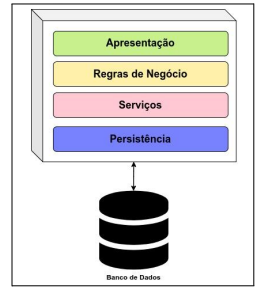
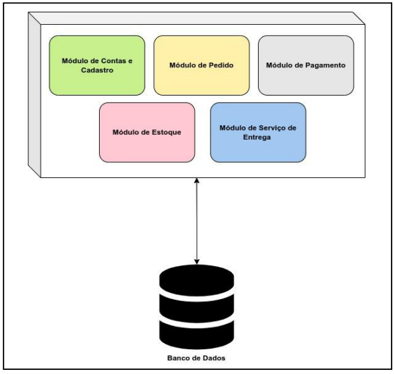

# Arquitetura Monolítica

Neste artigo, prosseguiremos com nossa discussão sobre a arquitetura de software, focando especificamente no estilo arquitetônico monolítico. Além disso, exploraremos tanto os aspectos positivos quanto os negativos deste estilo.

### 1. Arquitetura Monolítica

Richards e Ford (2020) classificam arquitetura de software em dois estilos, o primeiro é o estilo Monolítico e, o segundo, é o estilo distribuído.

De acordo com Richards e Ford (2020), a arquitetura monolítica pode ser caracterizada como sendo uma unidade única de software que concentra e centraliza todas as funcionalidades de um sistema e, normalmente, conecta-se a um único banco de dados. Nesta unidade estão as interfaces gráficas do sistema (front-ends) e códigos que implementam as funcionalidades do negócio e que realizam acesso aos dados (back-ends).

A Figura 1, ilustra um monólito particionado em camadas tecnológicas onde a camada de front-end é a camada que implementa as interfaces gráficas, a camada service implementa as regras do domínio da aplicação e a camada persistence implementa as rotinas para acesso, leitura e persistência dos dados.&#x20;

<figure><figcaption>
Figura 1 – Monólito particionado com camadas tecnológicas Fonte: (RICHARDS; FORD, 2020), adaptado pelo Auto
</figcaption></figure>

Devido a essa característica de unidade única, normalmente, um monólito é independente e auto-suficiente em relação a outros sistemas. Apesar de ser uma unidade completa, o que compromete a modularidade do sistema em possuir partes independentes, um monólito pode ser organizado de maneira modular através da separação dos domínios do negócio (RICHARDS; FORD, 2020). Na Figura 2, tem se um exemplo de monólito modular conectado a um único banco de dados.

<figure><figcaption>
Figura 2 – Monólito modular Fonte: (RICHARDS; FORD, 2020), adaptado pelo Autor
</figcaption></figure>

A arquitetura monolítica possui algumas desvantagens em relação a sua escalabilidade, agilidade e extensibilidade, pois para ser escalado, uma cópia do sistema inteiro deverá realizada, não apenas as partes que estão sob demanda elevada, levando a um consumo maior de recursos computacionais, como threads, CPU e memória. Além disso, o alto acoplamento no código que dificulta a extensibilidade (qualidade que permite ou favorece a adição de novos recursos ou funcionalidades) (FORD; RICHARDS, 2020).

Alguns exemplos de arquiteturas que seguem o estilo monolítico são RICHARDS; FORD, 2020):&#x20;

* Arquitetura em camadas;
* Arquitetura de pipeline;&#x20;
* Arquitetura de microkernel.

### 2. Referências

RICHARDS, Mark; FORD, Neal. Fundamentals of Software Architecture. 1st ed. Sebastopol: O'Reilly Media, 2020. 419 p. ISBN: 978-1-492-04345-4.
